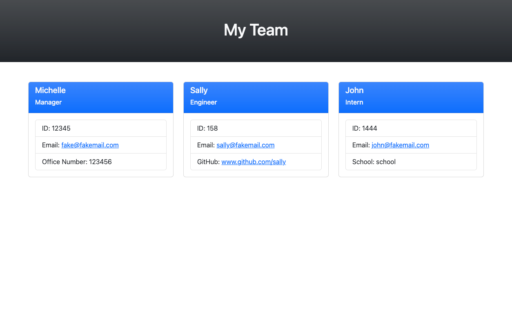

# Team Profile Generator

## Description

This application is a Node.js command-line application that takes in information about employees on a software engineering team, then generates an HTML webpage that displays summaries for each person. 

## Usage
* This is a command-line application that accepts user input and then a HTML file is generated that displays a nicely formatted team roster based on user input.
* When the email address in the HTML is clicked on, the default email program opens and populates the TO field of the email with the address.
* When the GitHub username is clicked, that GitHub profile opens in a new tab.
* After starting the application the user is prompted to enter the team manager’s name, employee ID, email address, and office number.
* After entering the team manager’s name, employee ID, email address, and office number, then the user is presented with a menu with the option to add an engineer or an intern or to finish building my team.
* When the user decides to finish building the team, they will exit the application, and the HTML is generated

The application will start by using the following command:
```md
node index.js
```

## Prerequisites 
* [Jest](https://www.npmjs.com/package/jest)
* [Inquirer](https://www.npmjs.com/package/inquirer/v/8.2.4)
* [Node.js](https://nodejs.org/en/)

## Walkthrough Video
https://user-images.githubusercontent.com/107455470/192404670-8bea9347-cef6-4496-92e9-c1eb524f53d3.mp4

## Mock-Up

The following image shows a mock-up of the generated HTML’s appearance and functionality:



GitHub Repository: https://github.com/mich-hales/team-profile-generator 
